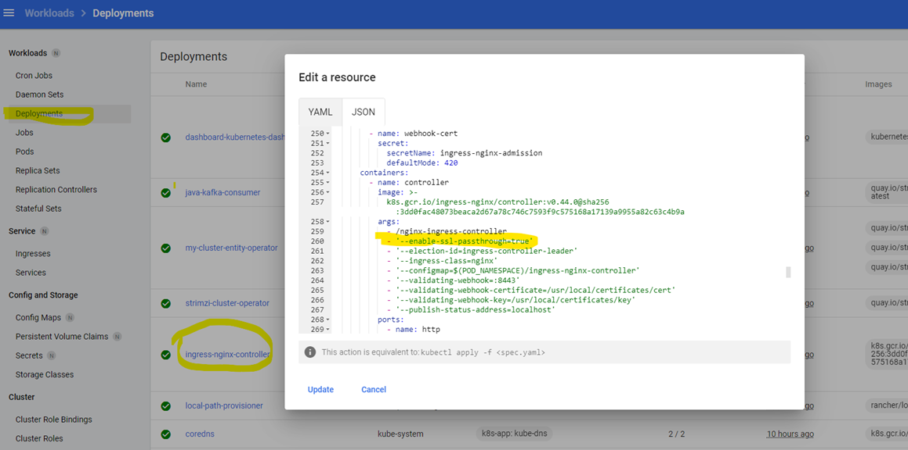

# Install Kubernetes Cluster
Install Kubernetes Kind cluster
```
cd ./kind
kind create cluster --config ./kind.yaml
```
# Ingress Installation for Kind 
Ingress required, ingress installation for kind Ingress NGINX - [Kind](https://kind.sigs.k8s.io/docs/user/ingress/#ingress-nginx)<br>
```
kubectl apply -f 'https://raw.githubusercontent.com/kubernetes/ingress-nginx/master/deploy/static/provider/kind/deploy.yaml'
```
Set **--enable-ssl-passthrough** flag to **true** <br>
Check the [SSL Passthrough](https://kubernetes.github.io/ingress-nginx/user-guide/tls/#ssl-passthrough) link for details<br>


# Strimzi Installation
Installing Strimzi Kubernetes Cluster
1. Create a kafka namespace 
```
kubectl create namespace kafka
```
2. Create strimzi operator
```
kubectl create -f 'https://strimzi.io/install/latest?namespace=kafka' -n kafka
```
3. Goto  strimzi directory  and create kafka cluster  (for single node installation use kafka-single.yaml)
```
cd ../strimzi
kubectl apply -f kafka.yaml -n kafka
kubectl wait kafka/my-cluster --for=condition=Ready --timeout=300s -n kafka
```
4. Check kafka cluster
```
kubectl get kafka -n kafka
kubectl get kafka -o yaml -n kafka
```
1. Create user resource, it will be an admin user, and will be fully authorized.
```
kubectl apply -f user_full.yaml -n kafka
```
6. Check secret
```
kubectl get secret my-user -n kafka
kubectl get secret my-user -o yaml -n kafka
```
7. Create a kafka topic (FOR TESTING)
```
kubectl apply -f topic.yaml -n kafka
```
8. Create producer and consumer (FOR TESTING)
```
kubectl apply -f hello-world.yaml -n kafka
kubectl get pods -n kafka
kubectl logs <consumer-pod-name> -f -n kafka
```
9. If you want you can delete consumer and producer deployments
```
kubectl delete deployment java-kafka-producer -n kafka
kubectl delete deployment java-kafka-consumer -n kafka
```
10. Publish message from .net client
```
kubectl port-forward my-cluster-kafka-0 9093:9093 -n kafka
```
11. I used kind kubernetes cluster and so set listeners' type **internal** type and added preceding lines to my hosts file, it shouldn't be necessary for loadbalancer or ingress case ...
```
127.0.0.1 my-cluster-kafka-0.my-cluster-kafka-brokers.kafka.svc
127.0.0.1 my-cluster-kafka-1.my-cluster-kafka-brokers.kafka.svc
127.0.0.1 my-cluster-kafka-2.my-cluster-kafka-brokers.kafka.svc
```
12.Read ca-cert with the following command, base64 decode and write it to **ca-root.crt** file
```
kubectl get secret my-cluster-cluster-ca-cert -o jsonpath='{.data.ca\.crt}' -n kafka
```
13.  Read my-user secret, Base64 decode **user.crt** data and save it to **user.crt** file.
Also, decode and save **user.key** data to **user.key** file
```
kubectl get secret my-user -o yaml -n kafka
```
14. Run .net console application publish message by writing to commandline somenthing and check consumer application logs with below commands
```
kubectl port-forward my-cluster-kafka-0 9093:9093 -n kafka
kubectl get pods -n kafka
kubectl logs <consumer-pod-name> -f -n kafka
```


# Strimzi Kafka Metrics configuration
Documentation : <br>
- [Introducing Metrics to Kafka](https://strimzi.io/docs/operators/master/deploying.html#assembly-metrics-str) <br>
<br>

Deployment Steps:
1. update *../kafka.yaml* file for metric configuration. Check *Strimzi-Kafka-Operator/examples/metrics/kafka-metrics.yaml* for the configuration
2. Create prometheus operator. Before running preceding commands Update *namespace: monitoring* in the yaml file with your own namespace name and use that name for the following commands
```
cd ./metrics
kubectl create namespace monitoring
kubectl apply -f ./01-prometheus-operator-deployment/
```
3. The Prometheus Operator does not have a monitoring resource like PodMonitor for scraping the nodes, so the *prometheus-additional.yaml* file contains the additional configuration needed. Edit the additionalScrapeConfigs property in the *prometheus.yaml* file to include the name of the Secret and the prometheus-additional.yaml file.
```
kubectl apply -f ./02-prometheus-additional-properties/ -n monitoring
```
4. Update **namespace: monitoring** in *prometheus.yaml* file with the namespace you created for prometheus.
   Update **namespaceSelector:** value which is **kafka** currently in *01-strimzi-pod-monitor.yaml* with your strimzi cluster namespace.
```
kubectl apply -f ./03-prometheus-install/ -n monitoring
```
5. Setting up [Prometheus Alert Manager](https://strimzi.io/docs/operators/master/deploying.html#assembly-metrics-prometheus-alertmanager-str)
```
kubectl apply -f ./04-prometheus-alertmanager-config/ -n monitoring
```
6. Create grafana service
```
kubectl apply -f ./05-grafana-install/ -n monitoring
```
7. Configure Grafana, add Promethues as a Datasource to Grafana and import grafana dashbords in *06-grafana-dashboards* directory
```
kubectl port-forward svc/grafana -n monitoring 3000:3000
kubectl port-forward svc/prometheus-operated  -n monitoring 9090:9090
```


# Lenses.io configuration for the Kafka Cluster
Documentation : <br>
- [Docker](https://docs.lenses.io/4.1/installation/docker/) <br>
- [Docker Quick Tour](https://docs.lenses.io/2.3/quick-tour/docker.html) <br>
- [Installation on Kubernetes with Helm charts](https://docs.lenses.io/4.1/installation/kubernetes/) <br>
- [Helm Chart Options](https://docs.lenses.io/4.1/configuration/options/helm/)
- [Lenses Helm Charts on Github](https://github.com/lensesio/lenses-helm-charts)<br>
<br>

Deployment Steps:
1. Create keystore file 
```
cd ../lenses.io
kubectl get secret my-user -n kafka -o jsonpath='{.data.user\.crt}' | base64 --decode > user.crt
kubectl get secret my-user -n kafka -o jsonpath='{.data.user\.key}' | base64 --decode > user.key
openssl pkcs12 -export -inkey user.key -in user.crt -out kafka-client.keystore.p12 -name kafka-key
---> !!!! Don't forget to change password 123456 with the value you used at previous commands !!!!
keytool -importkeystore -destkeystore kafka-client.keystore.jks -deststorepass 123456 -srckeystore kafka-client.keystore.p12 -srcstoretype PKCS12 -srcstorepass 123456 
```
2. base64 encode kafka-client.keystore.jks file and set **keyStoreFileData** in lenses.tls.yaml
```
openssl base64 < kafka-client.keystore.jks | tr -d '\n' > keyStoreFileData.txt
```
3. Create Truststore file 
```
kubectl get secret my-cluster-cluster-ca-cert -n kafka -o jsonpath='{.data.ca\.password}' | base64 --decode > ca.password
kubectl get secret my-cluster-cluster-ca-cert -n kafka -o jsonpath='{.data.ca\.crt}' | base64 -d > ca.crt
keytool -importcert -alias KafkaCA -file ca.crt -keystore kafka-client.truststore.jks -keypass <write password in ca.password file>
```
4. base64 encode *kafka-client.truststore.jks* file and set *trustStoreFileData* in *lenses.tls.yaml*
```
openssl base64 < kafka-client.truststore.jks | tr -d '\n' > trustStoreFileData.txt
```
5. Update related fields at **lenses.tls.yaml** with the generated keyStoreFileData.txt, trustStoreFileData.txt, password used while truststore generations and lenses license url before running preceding commands
```
kubectl create namespace lenses
helm repo add lensesio https://helm.repo.lenses.io
helm repo update
helm install lenses lensesio/lenses -f lenses.tls.yaml -n lenses
kubectl port-forward <lenses-pod-name> -n lenses 3030:3030
``` 
6. Go to http://localhost/  to use lenses. Default *username/password* is *admin/admin*


<!-- 
kubectl get secret my-cluster-cluster-ca-cert -n kafka -o jsonpath='{.data.ca\.crt}' | base64 -d > ca.crt
kubectl get secret my-user -n kafka -o jsonpath='{.data.user\.password}' | base64 -d > user.password
kubectl get secret my-user -n kafka  -o jsonpath='{.data.user\.p12}' | base64 -d > user.p12


keytool -keystore user-truststore.jks -alias CARoot -import -file ca.crt
openssl base64 < user-truststore.jks | tr -d '\n'

keytool -importkeystore -srckeystore user.p12 -srcstoretype pkcs12 -destkeystore user-keystore.jks -deststoretype jks
openssl base64 < user-keystore.jks | tr -d '\n' -->

